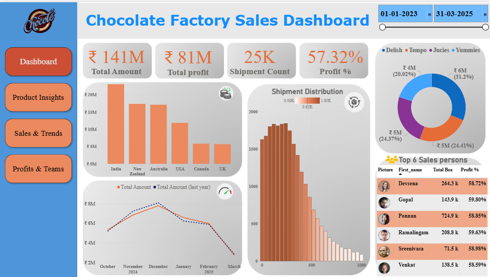
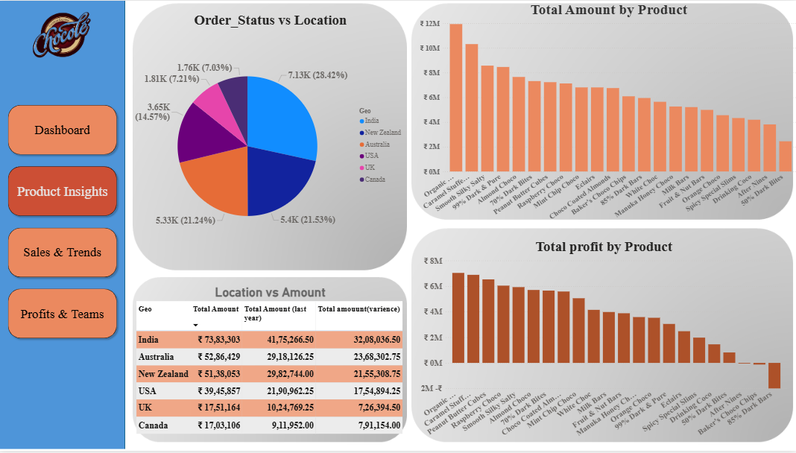
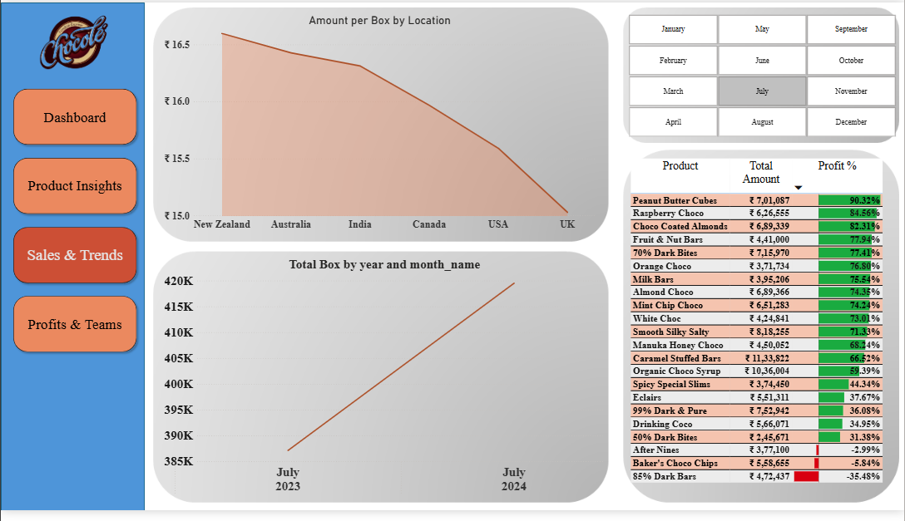
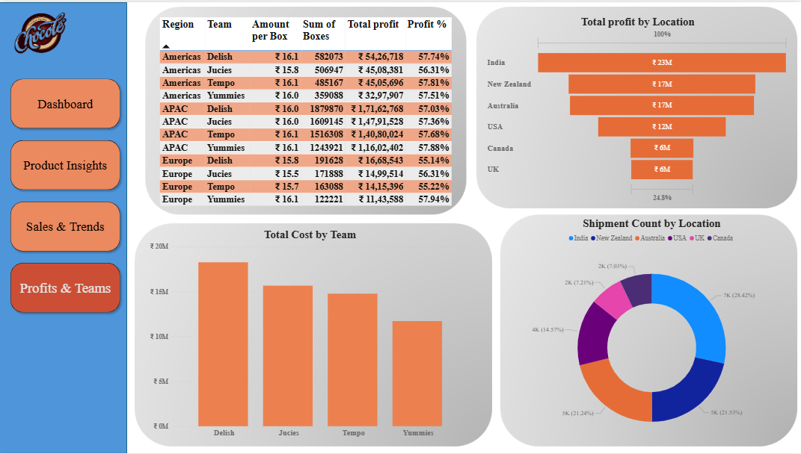

# 🍫 Chocolate Company Sales Dashboard – Power BI Project

This project is an interactive Power BI dashboard designed for a fictional chocolate manufacturing company to analyze its sales performance, profitability, and operational trends across regions, products, teams, and time.

## 📊 Project Overview

The dashboard helps stakeholders:
- Monitor sales KPIs at a glance
- Drill into product-wise and location-wise performance
- Track shipment trends over time
- Compare team profitability and costs
- Make data-driven decisions

---

## 📁 Dataset

The dataset includes shipment records from multiple countries over a 2-year period.  
It contains the following tables:

- **Shipments**: Amount, Cost, Profit, Product ID, Salesperson ID, Shipment Date, Boxes
- **Products**: Product Name, Category, Cost per Box, Product ID
- **People**: Salesperson, Team, SPID
- **Locations**: Country, Region, Geo Code
- **Calendar**: Date, Month, Year breakdown

---

## 📐 Data Model & Relationships

- `Shipments[PID] → Products[PID]`
- `Shipments[SPID] → People[SPID]`
- `Shipments[GID] → Locations[GID]`
- `Shipments[Shipdate] → Calendar[cal_date]`

`Calendar` is marked as the official date table.

---

## 📄 Pages in the Dashboard

### 1. 🏠 **Dashboard (Home Page)**
- **KPI Cards**: Total Amount, Total Profit, Shipment Count, Profit %
- **Bar Chart**: Total Amount by Country
- **Line Chart**: Amount Trend vs. Last Year
- **Histogram**: Shipment Distribution
- **Donut Chart**: Product Category Share
- **Salesperson Table**: Top 6 by Profit %
- **Date Range Slicer**: Fully interactive filtering
- **Navigation Buttons**: Link to other report pages

---

### 2. 🍫 **Product Insights**
- **Pie Chart**: Order Status vs. Location
- **Bar Chart**: Total Amount by Product
- **Bar Chart**: Total Profit by Product
- **Table**: Location-wise comparison with variance
- **Slicer**: Category filter for deeper product drill-down

---

### 3. 📈 **Sales & Trends**
- **Line Chart**: Amount per Box by Country
- **Line Chart**: Monthly Box Trends (YoY)
- **Grid Table**: Monthly filter slicer
- **Bar Chart**: Product-wise Profit % (Color formatted)
- **Product List**: Profit % and Total Amount sorted

---

### 4. 🌍 **Profits & Teams**
- **Matrix/Table**: Region, Team, Boxes, Profit %
- **Bar Chart**: Total Profit by Location
- **Donut Chart**: Shipment Count by Country
- **Bar Chart**: Team-wise Cost Comparison
- **Slicer**: Team / Region filters available

---

## 🔄 Features

- Interactive navigation using buttons
- Consistent theme, styled in brand colors
- Drill-down and tooltip-enabled visuals
- Sync slicers across pages for smooth filtering
- Performance comparison across years and teams

---

## 🛠 Tools & Technologies

- **Power BI Desktop**
- **DAX** (for measures like Profit %, Amount Variance, etc.)
- **Power Query Editor** (for data shaping)
- **Custom visual formatting** with images, slicers, and buttons

---

## 📷 Screenshots

| Page | Preview |
|------|---------|
| Dashboard |  |
| Product Insights |  |
| Sales & Trends |  |
| Profits & Teams |  |

---

## 📌 How to Use

1. Download the `.pbix` file from this repository
2. Open with Power BI Desktop
3. Explore each page, filter the visuals, or export reports
4. Customize for your own dataset if needed

---

## 🧠 Learnings & Highlights

- Created a full business-friendly navigation layout with custom buttons
- Built over 20+ visuals including KPIs, bar charts, maps, and tables
- Enhanced storytelling with interactivity, conditional formatting, and color-coded KPIs
- Applied real-world best practices in dashboard design and layout

---

